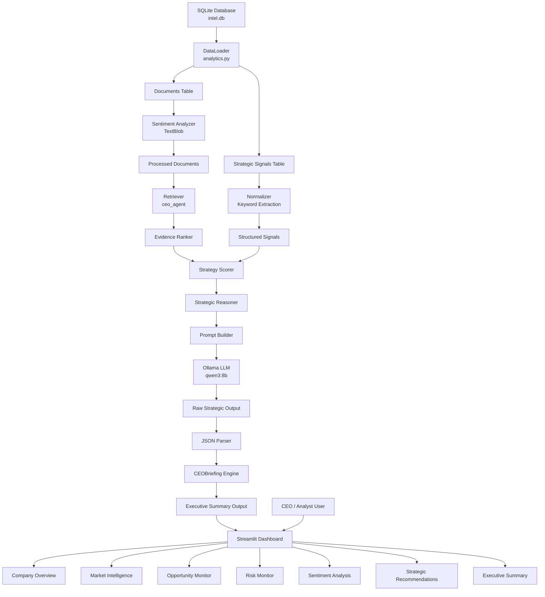

# NVIDIA_project

```mermaid
flowchart TD

%% =======================
%% DATA LAYER
%% =======================
A[SQLite Database<br>intel.db] --> B[DataLoader<br>analytics.py]

B --> C1[Documents Table]
B --> C2[Strategic Signals Table]

%% =======================
%% PROCESSING LAYER
%% =======================
C1 --> D1[Sentiment Analyzer<br>TextBlob]
C2 --> D2[Normalizer<br>Keyword Extraction]

D1 --> E1[Processed Documents]
D2 --> E2[Structured Signals]

%% =======================
%% INTELLIGENCE LAYER
%% =======================
E1 --> F1[Retriever<br>ceo_agent]
F1 --> F2[Evidence Ranker]
F2 --> F3[Strategy Scorer]

E2 --> F3

F3 --> G[Strategic Reasoner]

G --> H[Prompt Builder]

%% =======================
%% LLM LAYER
%% =======================
H --> I[Ollama LLM<br>qwen3:8b]

I --> J[Raw Strategic Output]

%% =======================
%% POST-PROCESSING
%% =======================
J --> K[JSON Parser]
K --> L[CEOBriefing Engine]

L --> M[Executive Summary Output]

%% =======================
%% PRESENTATION LAYER
%% =======================
M --> N[Streamlit Dashboard]

N --> N1[Company Overview]
N --> N2[Market Intelligence]
N --> N3[Opportunity Monitor]
N --> N4[Risk Monitor]
N --> N5[Sentiment Analysis]
N --> N6[Strategic Recommendations]
N --> N7[Executive Summary]

%% =======================
%% USER
%% =======================
U[CEO / Analyst User] --> N
```

## Dataflow Diagram

```mermaid
flowchart LR

User --> Dashboard

Dashboard --> DataLoader
DataLoader --> SQLite_DB

SQLite_DB --> Documents
SQLite_DB --> Strategic_Signals

Documents --> Sentiment_Model
Strategic_Signals --> Keyword_Normalizer

Sentiment_Model --> Docs_Enriched
Keyword_Normalizer --> Signals_Processed

Docs_Enriched --> Retriever
Signals_Processed --> Strategy_Scorer

Retriever --> Ranker --> Reasoner

Reasoner --> Prompt_Builder

Prompt_Builder --> Ollama_LLM

Ollama_LLM --> JSON_Output

JSON_Output --> Briefing_Engine

Briefing_Engine --> Streamlit_UI

Streamlit_UI --> CEO_Dashboard
```
