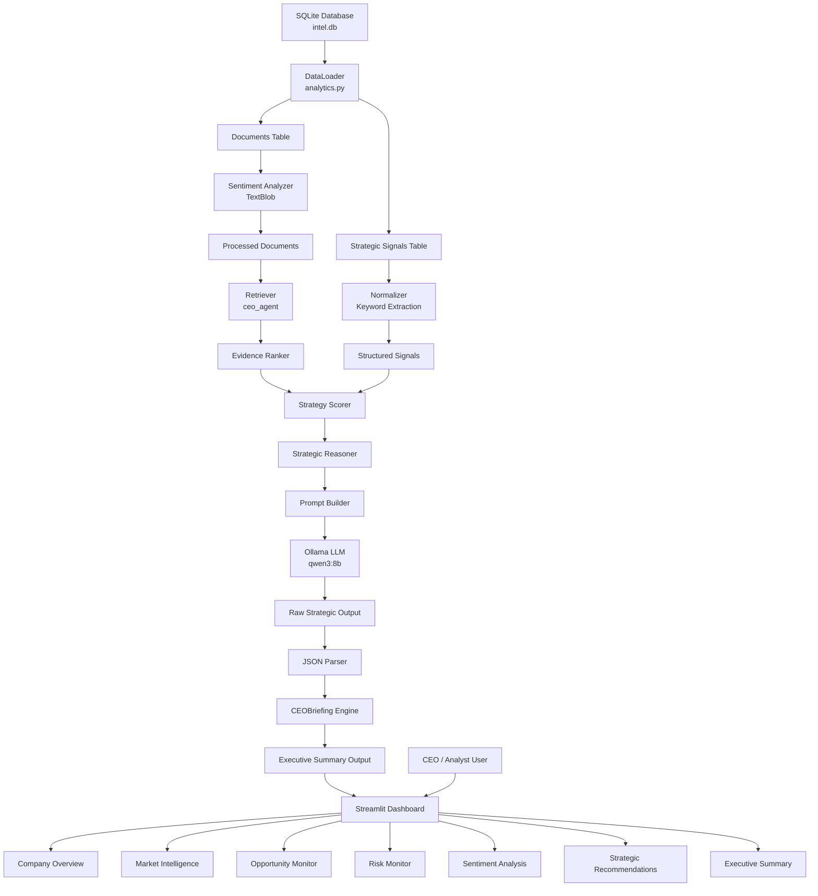

# NVIDIA Executive Intelligence Platform

An AI-powered Executive Decision Intelligence System designed to transform unstructured market intelligence into strategic recommendations for executive leadership.

The platform continuously collects news, technology updates, competitor activities, regulatory developments, and industry signals related to NVIDIA and the broader AI ecosystem. Using semantic retrieval, AI-driven reasoning, sentiment analysis, and strategic signal scoring, the system generates executive-level insights that support high-impact business decision-making.

The solution combines Retrieval-Augmented Generation (RAG), semantic search, strategic reasoning agents, and executive dashboards into a single intelligence workflow.

## Key Features

### Market Intelligence Collection

* Automated collection of news articles and intelligence reports
* Multi-source data ingestion pipeline
* Structured storage in SQLite database
* Content cleaning and normalization

### Semantic Intelligence Engine

* Vector embeddings using BAAI bge-small-en-v1.5
* Semantic similarity search for evidence retrieval
* Context-aware document ranking
* Retrieval-Augmented Generation (RAG)

### Strategic Signal Analysis

* Opportunity detection
* Risk identification
* Trend monitoring
* Signal scoring and prioritization

### Executive AI Agent

* Powered by Qwen3 8B Large Language Model
* Strategic reasoning engine
* Evidence-backed recommendations
* Executive decision support generation

### Sentiment Intelligence

* News sentiment classification
* Positive / Neutral / Negative trend analysis
* Executive-level sentiment monitoring

### Interactive Dashboard

* Streamlit-based executive dashboard
* Company overview metrics
* Market intelligence monitoring
* Opportunity and risk visualization
* Strategic recommendation generation
* Dynamic CEO briefing system

## System Architecture

The platform follows a multi-layer AI architecture:

Data Sources
→ Data Collection Layer
→ Data Cleaning & Normalization
→ Intelligence Database
→ Semantic Embedding Generation
→ Vector Retrieval Engine
→ Evidence Ranking Layer
→ Strategic Signal Scoring
→ AI Reasoning Engine
→ Qwen3 8B Executive Agent
→ Executive Dashboard

## Technology Stack

### Artificial Intelligence

* Qwen3 8B
* BAAI bge-small-en-v1.5
* Retrieval-Augmented Generation (RAG)

### Machine Learning

* Sentence Transformers
* Semantic Embeddings
* Similarity Search

### Data Engineering

* SQLite
* Pandas
* BeautifulSoup
* JSON Processing

### Dashboard & Visualization

* Streamlit
* Plotly
* Interactive Executive Analytics

### Development

* Python
* Object-Oriented Architecture
* Modular AI Pipeline

## Business Value

The platform enables executives to:

* Monitor market changes in real time
* Detect emerging opportunities
* Identify strategic risks early
* Understand sentiment trends
* Generate evidence-backed recommendations
* Accelerate executive decision making

## Example Executive Questions

* What are the biggest opportunities for NVIDIA over the next three years?
* What strategic risks could impact GPU market leadership?
* Which emerging AI technologies should NVIDIA prioritize?
* How is market sentiment evolving around AI infrastructure?
* What partnerships should NVIDIA pursue to strengthen competitive advantage?

## Project Outcome

This project demonstrates how modern AI systems can combine semantic retrieval, strategic reasoning, and executive analytics to create a corporate-grade decision intelligence platform capable of supporting C-level strategic planning.

## Dataflow Diagram

```mermaid
flowchart LR

User --> Dashboard

Dashboard --> DataLoader
DataLoader --> SQLite_DB

SQLite_DB --> Documents
SQLite_DB --> Strategic_Signals

Documents --> Sentiment_Model
Strategic_Signals --> Keyword_Normalizer

Sentiment_Model --> Docs_Enriched
Keyword_Normalizer --> Signals_Processed

Docs_Enriched --> Retriever
Signals_Processed --> Strategy_Scorer

Retriever --> Ranker --> Reasoner

Reasoner --> Prompt_Builder

Prompt_Builder --> Ollama_LLM

Ollama_LLM --> JSON_Output

JSON_Output --> Briefing_Engine

Briefing_Engine --> Streamlit_UI

Streamlit_UI --> CEO_Dashboard
```

### Backend
- Python 3.10+
- SQLite (Intel DB)
- Ollama (LLM inference)
- TextBlob (Sentiment analysis)

### AI/ML Layer
- Custom Retriever
- Evidence Ranker
- Strategy Scorer
- Strategic Reasoner

### Frontend
- Streamlit (Dashboard UI)
- Plotly (Visualizations)

### Data Processing
- Pandas
- Regex Normalization Engine

### Infrastructure
- Local LLM (qwen3:8b)
- Modular Python microservices architecture

  ---

## ⚙ Technology Stack

- Python
- Streamlit
- SQLite
- Pandas
- Ollama (Qwen3)
- TextBlob
- Plotly

---
